# IMDb TV Series Market Analysis: Data Warehouse Lab Report

**Course:** Master in Data Science and Engineering (MECD) - FEUP

**Subject:** Data Warehouses (2026) 

**Professor:** Gabriel David  

**Authors:** Davi Santos (up202310061), André de Oliveira (up202403079), Daniel Martinez (up202400081)  

---

## 1. Subject Description and Goals

The core of this project is the design and implementation of a dimensional model based on the IMDb dataset to analyze the global TV Series market. While the source data is vast, covering everything from cinema to documentaries, our objective is to isolate and study **TV Series** released from the year **2000 onwards**, excluding adult content. This specific subset allows for a manageable yet "Big Data" scale analysis of modern television trends.

The primary goals are to evaluate series industry performance through their caracteristics, also considering their ratings and viewer engagement, and finally to map the professional networks of the cast and crew (participations). By moving from an operational, normalized structure to a de-normalized star schema, we aim to facilitate complex analytical queries such as identifying "quality fatigue" across seasons or detecting high-impact collaborations between industry professionals.

## 2. Planning: Dimensional Bus Matrix, Dimensions and Facts Dictionary

Our planning phase was guided by the need for conformed dimensions, ensuring that entities like "Series" or "Time" remain consistent across different analysis stars.

### Dimensional Bus Matrix
The following matrix illustrates how our facts interact with shared dimensions:

| Data Mart | Fact / Star | dim_time | dim_title | dim_season | dim_episode | dim_genre | bridge_genres | dim_person | dim_profession | dim_role |
| :--- | :--- | :---: | :---: | :---: | :---: | :---: | :---: | :---: | :---: | :---: |
| **TV Series** | fact_series_performance | X | X | X | | X | X | | | |
| **TV Series** | fact_ratings | |X| | X | | X | X | X | |
| **TV Series** | participations_pers | |X| | | | X | X | X | X |

### Dimensions Dictionary (Summary)
 
| Dimension | SCD | Grain | Key Attributes | Source |
|:---|:---:|:---|:---|:---|
| `dim_time` | Type 1 | One row per year | year, decade, tv_era, period | Generated (1900–2030) |
| `dim_title` | Type 2 | One row per TV series | sk_title, primaryTitle, startYear, endYear, runtimeMinutes, sk_genre_group | title_basics |
| `dim_season` | Type 1 | One row per (series, season) | sk_season_id, sk_title, sk_season | title_episode |
| `dim_genre` | Type 1 | One row per genre | sk_genre, genre_nm, category | title_basics (exploded) |
| `dim_episode` | Type 1 | One row per episode | sk_episode, sk_title, sk_season, episode_num | title_episode |
| `dim_person` | Type 1 | One row per person | sk_person, primaryName, birthYear, deathYear, sk_profession_group | name_basics |
| `dim_profession` | Type 1 | One row per profession | sk_profession, profession_nm | name_basics (exploded) |
| `bridge_genres` | — | One row per (title, genre) | sk_title, sk_genre, sk_genre_group, weighting_factor_gen | title_basics |
| `bridge_profession_group` | — | One row per (person, profession) | sk_person, sk_profession, sk_profession_group, weight_factor_prf | name_basics |
 
> **Design note:** `dim_season` contains **only descriptive attributes** — no measures. All measures (`avg_rating`, `total_votes`, `num_episodes`) live exclusively in `fact_series_performance`.

### Facts Dictionary (Summary)

#### fact_series_performance (Periodic Snapshot)
 
| | |
|:---|:---|
| **Grain** | One row per series × season × release year × genre |
| **Type** | Periodic Snapshot |
| **Description** | Aggregates episode-level data into seasonal snapshots per series, enabling trend analysis of rating quality, audience engagement, and genre dominance over time.|
 
| Measure | Type | SQL Type | Formula (ETL) |
|:---|:---:|:---:|:---|
| `num_episodes` | Additive | SMALLINT | `COUNT(sk_episode)` aggregated from dim_episode |
| `total_runtime_min` | Additive | INTEGER | `SUM(runtimeMinutes)` |
| `total_votes` | Additive | INTEGER | `SUM(numVotes)` |
| `avg_rating` | Semi-additive | NUMERIC(3,1) | `AVG(averageRating)` |
| `rating_max` | Semi-additive | NUMERIC(3,1) | `MAX(averageRating)` |
| `rating_min` | Semi-additive | NUMERIC(3,1) | `MIN(averageRating)` |
| `stddev_rating` | Semi-additive | NUMERIC(4,2) | `STDDEV(averageRating)` |
 
> **Note:** Semi-additive measures (`avg_rating`, `stddev_rating`) can be compared within the same series/period but **MUST NOT be summed** across different series.
 
#### fact_ratings (Transaction Fact)
 
| | |
|:---|:---|
| **Grain** | The grain of this table is defined at the Participant-per-Episode level. This means there is one row for every person (Actor, Director, Writer, etc.) associated with a specific episode of a TV Series. |
| **Type** | Transaction Fact |
| **Description** | This table captures the performance metrics (ratings and votes) of episodes, mapped to every individual involved in the production.|
 
| Measure |     Type      | SQL Type | Formula                                                                                                                                       |
|:---|:-------------:|:---:|:----------------------------------------------------------------------------------------------------------------------------------------------|
| `average_rating` | Non-Additive  | NUMERIC(3,1) | `averageRating` from title.ratings. Must be averaged carefully across dimensions.                                                             |
| `num_votes` | Semi-Additive | INTEGER | `numVotes` from `title.ratings`. **Warning:** Values are duplicated per participant. DISTINCT or MAX logic should be used for correct totals. |
 
#### participations_pers (Factless Fact)
 
| | |
|:---|:---|
| **Grain** | One row per person × title × role |
| **Type** | Factless Fact Table |
| **Description** | Records every person-title-role combination as a factless event, enabling analysis of participation patterns, career specialisation, and collaborative networks across the TV industry.|
 
| Measure | Type | Notes |
|:---|:---:|:---|
| `participation_count` | Additive | Always = 1, used as additive counter |
| `runtimeMinutes` | Semi-additive | Denormalized from dim_title |
 

---

## 3. Dimensional Data Model

The model is built on three primary Star Schemas:
 
- **fact_series_performance** — TV series market performance, aggregated at season level.

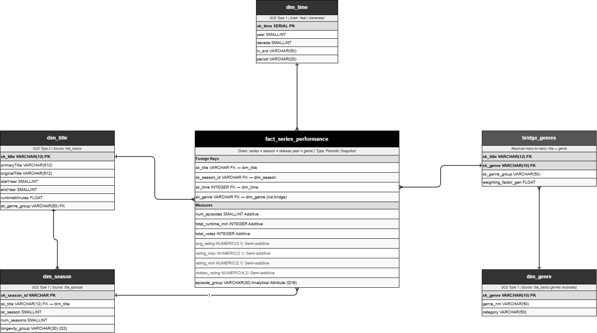

- **fact_ratings** — Episode-level ratings linked to cast and crew.

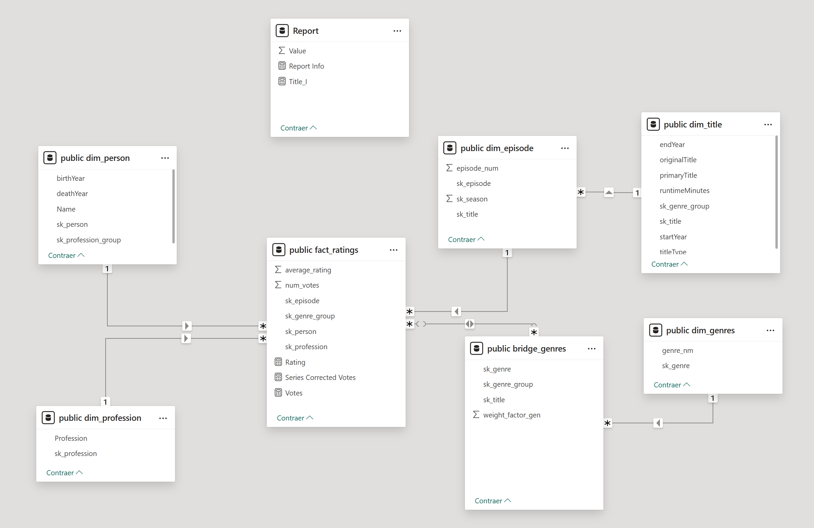

- **fact_participations** — Factless fact table linked to dimensional information about the participants and title.

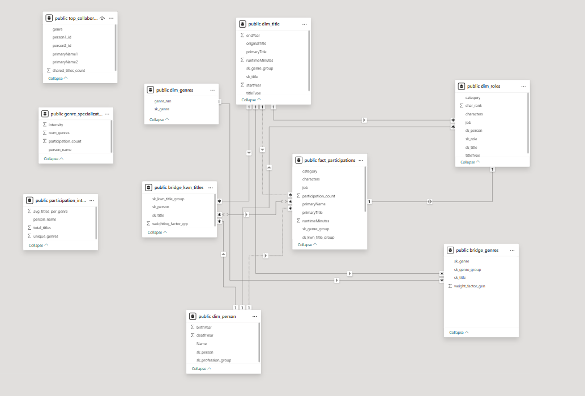

### Example: dim_series (Dummy Data)
| sk_title | tconst | primaryTitle | startYear |
| :--- | :--- | :--- | :--- |
| 1001 | tt0903747 | Breaking Bad | 2008 |
| 1002 | tt0944947 | Game of Thrones | 2011 |

### Example: fact_series_performance (Dummy Data)
| sk_title | sk_time | season_num | avg_rating | num_episodes | total_votes |
| :--- | :--- | :--- | :--- | :--- | :--- |
| 1001 | 2008 | 1 | 8.8 | 7 | 155000 |
| 1001 | 2009 | 2 | 9.0 | 13 | 162000 |
| 1002 | 2011 | 1 | 9.1 | 10 | 210000 |

> **Note:** The model utilizes Bridge Tables (e.g., `bridge_genres`) to ensure that a series with multiple genres (e.g., "Drama", "Crime") does not result in double-counting measures during aggregation.

---

## 4. Data Sources selection. Extraction, transformation and loading.

### Data Source

The data was sourced from the IMDb public TSV files. 

### Core Components of the ETL Pipeline

To ensure a professional and scalable data pipeline, we implemented a modular architecture using Python classes. This approach divides the data lifecycle into three distinct layers: Bronze (Raw TSV), Silver (Cleaned Parquet), and Gold (PostgreSQL Warehouse).

#### The BPMN Diagram:

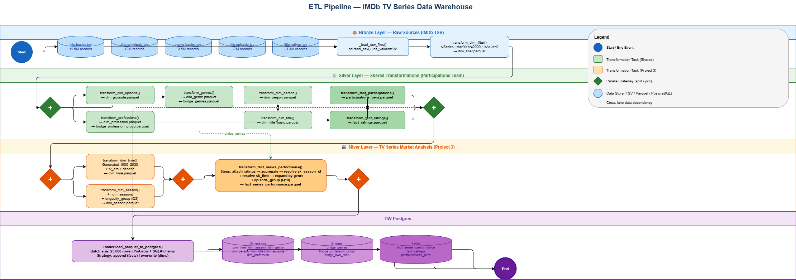

#### The Transformer Class

This class acts as the business logic engine. It encapsulates all transformation rules, ensuring that data is filtered and standardized before leaving the Python environment.

- **Encapsulation:** Each dimension and fact table has its own dedicated method (e.g., transform_dim_episode).
- **Memory Efficiency:** Uses pandas with specific data types and gc.collect() to handle large-scale IMDb datasets without crashing local environments.
- **Consistency:** Implements a Master Filter logic that cascades through all methods, ensuring only TV Series post-2000 are processed.

#### The Loader Class

The Loader is responsible for the physical movement of data from the Silver layer (Parquet) to the PostgreSQL Data Warehouse.

- **Batch Processing:** To prevent RAM saturation, it utilizes pyarrow.parquet.iter_batches to stream data in configurable batches (default: 25,000 rows).
- **Database Integration:** Leverages SQLAlchemy and the multi method for optimized PostgreSQL inserts.
- **Schema Flexibility:** Supports "Replace" and "Append" strategies to initialize or update the Star Schema.


### Bronze to Silver Layer Transformations

#### Data Extraction

Raw data source files from IMDB:
- `name.basics.tsv` - Participant information (9.5M+ records)
- `title.basics.tsv` - Title information (11.5M+ records)
- `title.principals.tsv` - Participation records (42M+ records)
- `title.episode.tsv` - Episode information
- `title.ratings.tsv` - Rating data

#### Initial Filtering - TV Series Focus

Created `dim_filter` table to establish filtering criteria: 
- titleType = 'tvSeries'
- startYear >= 2000
- isAdult = 0


**Impact:**
- Initial records: ~11.5M all titles → **Filtered TV Series: ~300K records**
- This filter cascades through all dimensional tables via inner joins
- Ensures data consistency and referential integrity

#### Dimensional Table Creation with Filtering

##### dim_profession & bridge_profession_group
**Purpose:** Normalize participant professions and handle many-to-many relationships with weighting factors.

**Transformation Logic:**
```
Input: name_basics.primaryProfession (comma-separated)
└─→ Split & Explode
    └─→ Create dim_profession (unique professions)
        └─→ Map surrogate keys: sk_profession
            └─→ Create bridge_profession_group
                └─→ Join with dim_filter (sk_person)
                    └─→ Create sk_profession_group (per person)
                        └─→ Calculate weight_factor_prf = 1/count(professions per person)
```

**Key Metrics:**
- Unique professions in dataset: 32
- Participants with professions (TV series): ~50K
- Average professions per participant: 1.3

##### dim_person
**Purpose:** Central participant dimension with demographic and professional group context.

**Transformation Logic:**
```
Input: name.basics 
└─→ Select & Rename: nconst → sk_person, primaryName, birthYear, deathYear
    └─→ Join with bridge_profession_group (inner)
        └─→ Extract sk_profession_group
            └─→ Filter: Keep only participants in dim_filter
Output: Unique participants with biographical & profession group data
```


##### dim_roles
**Purpose:** Granular detail of every character and role played by a participant.

**Transformation Logic:**
```
Input: title_principals + title_basics
└─→ Parse character strings (ast.literal_eval) & Explode list
    └─→ Generate char_rank (per participation)
        └─→ Create sk_role = sk_person + sk_title + ordering + char_rank
            └─→ Join with title_basics (titleType)
                └─→ Apply dim_filter (sk_person & sk_title)
Output: Records of roles including category, job, and specific characters
```

**Columns:** role_id, nconst, tconst, titleType, category, job, characters

##### dim_title_basic
**Purpose:** Master metadata for TV Series and their genre group associations.

**Transformation Logic:**
```
Input: title_basics filtered for TV series (startYear >= 2000)
└─→ Rename: tconst → sk_title
    └─→ Select: titleType, primaryTitle, originalTitle, startYear, endYear, runtimeMinutes
        └─→ Left Join with bridge_genres (sk_genre_group)
            └─→ Apply dim_filter (sk_title)
```

##### dim_genre & bridge_genres
**Purpose:** Standardize genres and manage the multi-genre nature of TV series.

**Transformation Logic:**
```
Input: title_basics.genres (comma-separated)
└─→ Split & Explode
    └─→ Create dim_genres (unique genres) + sk_genre
        └─→ Create bridge_genres (sk_title + sk_genre)
            └─→ Create sk_genre_group (per series)
                └─→ Calculate weight_factor_gen = 1/count(genres per title)
                    └─→ Filter via dim_filter (sk_title)
```

##### dim_episode
**Purpose:** Hierarchical dimension linking episodes to their parent series and seasons.

**Transformation Logic:**
```
Input: title_episodes + dim_filter
└─→ Inner Join: parentTconst with dim_filter.sk_title
    └─→ Rename: tconst → sk_episode, parentTconst → sk_title
        └─→ Rename: seasonNumber → sk_season, episodeNumber → episode_num
            └─→ Cast numeric types for season and episode numbers
```

##### dim_season
**Purpose:** Intermediate hierarchy level for season-based performance analysis.

**Transformation Logic:**
```
Input: dim_episode
└─→ Select: sk_title, sk_season (Drop Duplicates)
    └─→ Generate sk_season_id = sk_title + "_s" + sk_season
        └─→ Sort by Series and Season number
```

##### dim_time
**Purpose:** Temporal dimension for trend analysis and TV era grouping.

**Transformation Logic:**
```
Input: Programmatic generation (Years 1900-2030)
└─→ Create sk_time (surrogate) and year (natural)
    └─→ Map tv_era: Classic, Cable, Quality, or Streaming Era
        └─→ Map period: Decade-based groupings (e.g., 2000-2009)
```

##### bridge_kwn_titles
**Purpose:** Linkage between participants and the titles they are most "Known For".

**Transformation Logic:**
```
Input: name_basics.knownForTitles (comma-separated)
└─→ Split & Explode
    └─→ Rename: tconst → sk_title, nconst → sk_person
        └─→ Inner Join: dim_filter (sk_person & sk_title)
            └─→ Create sk_kwn_title_group & weight_factor_grp
```

### Fact Table Creation

##### fact_participations
**Purpose:** Transactional fact table recording all production involvements.

**Transformation Logic:**
```
Input: dim_title + dim_roles + dim_person + bridge_kwn_titles
└─→ Multi-Join: Connect Series, Roles, Persons, and Known Titles
    └─→ Filter: Final validation with dim_filter (inner)
        └─→ Constant: participation_count = 1
```

##### fact_ratings
**Purpose:** Fact table expanding episode quality metrics to participants.

**Transformation Logic:**
```
Input: title.ratings + dim_episode + title_principals + dim_profession
└─→ Join: Ratings with Episodes (sk_episode)
    └─→ Join: Principals (sk_person) to expand ratings per participant
        └─→ Join: dim_profession to map specific sk_profession
            └─→ Join: dim_title to inherit sk_genre_group
```

##### fact_series_performance
**Purpose:** Periodic snapshot fact table for high-level series and season metrics.

**Transformation Logic:**
```
Input: dim_episode + title.ratings + title_basics (runtime)
└─→ Aggregate by (sk_title, sk_season):
    ├─ Additive: num_episodes, total_runtime, total_votes
    └─ Semi-Additive: avg_rating, rating_max, rating_min, stddev_rating
        └─→ Join: dim_season (sk_season_id)
            └─→ Join: dim_time (sk_time) via startYear
                └─→ Join: bridge_gen (Expand per sk_genre)
```

---

## 5. Querying and Data Analysis

We have defined some questions to guide our analysis.

| Research Questions — TV Series Market Analysis (IMDb)               |                                                                                                                                                        |
|---------------------------------------------------------------------|--------------------------------------------------------------------------------------------------------------------------------------------------------|
| Project 3 | Data Warehouse — Master in Data Science and Engineering |                                                                                                                                                        |
| #                                                                   | Research Question                                                                                                                                      |
| Q1                                                                  | Do series with more seasons have better or worse ratings over time?<br>Is there a 'quality fatigue' point as seasons increase?                         |
| Q2                                                                  | Which TV genres dominated each decade and how did their average quality evolve?<br>From Westerns to Drama to Reality — what trends emerge?             |
| Q3                                                                  | Do shorter series (1–2 seasons) have more consistent ratings than long-running ones?<br>Comparing quality variance: mini-series vs sagas.              |
| Q4                                                                  | How has audience engagement (votes) in TV series evolved across decades?<br>Have series become more popular and when did streaming change the pattern? |
| Q5                                                                  | Which genres consistently receive the highest average ratings?                                                                                         |
| Q6                                                                  | Which genres are consistently the most popular based on the number of votes?                                                                           |
| Q7                                                                  | Who are the top 10 actors whose movies have the highest average rating with at least 100,000 total votes?                                              |
| Q8                                                                  | Who are the top 10 directors whose movies have the highest average rating with at least 100,000 total votes?                                           |
| Q9                                                                  | What is the correlation between the total number of episodes in a series and its overall average rating?                                               |
| Q10                                                                 | At what point (season/episode number) do highly-rated series typically start to see a significant decline in user ratings? (Jum the Shark effect)      |
| Q11                                                                 | Who are the most active participants in the IMDB dataset by number of participations?                                     |
| Q12                                                                 | Which participants are highlighted by specialization or generalization in terms of genres worked in their careers?                                                         |
| Q13                                                                 | Which pairs of participants have the strongest collaborative relationships appearing together in the most titles and which genres their worked on?         |
| Q14                                                                 | Who have more titles per genre (specialist in certain genres) and how many titles have they worked on?                                                               |
| Q15                                                                 | Does episode count per season affect perceived quality? Do shorter seasons rate higher?                                                                |

---

## 6. Visualization

To communicate the findings, the following visualizations are implemented:
* **Heatmaps:** To cross-reference Decades vs. Genres, with color intensity representing the average rating.
* **Line Charts:** To plot the "Quality Fatigue" (Season Number vs. Avg Rating) for the top 50 most-voted series.
* **Network Graphs:** To visualize the "Strongest Collaborations" (Q16), where nodes represent people and edge weights represent shared projects.
* **Dual-Axis Charts:** Comparing the number of unique participants vs. the total number of series produced per year.

### Q1 — Global Rating Trend by Season
 
**Visual 1 — Global Rating Trend (all series):** Line chart with linear regression trendline. X-axis: `sk_season` (filtered ≤ 20), Y-axis: `Avg Rating`. The trendline descends from 7.6 (season 1) to ~7.0 (season 20), providing statistical confirmation of quality fatigue across the full dataset.

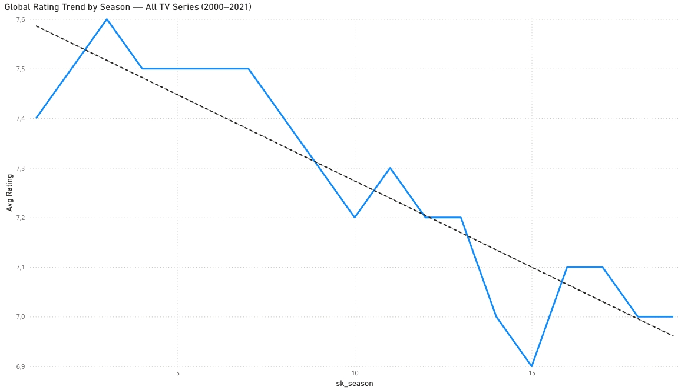 
 
**Visual 2 — Top 10 Most Voted Series (exploratory):** Line chart with one line per series, filtered to Top 10 by Total Votes. Game of Thrones is highlighted — its collapse from 9.1 in season 7 to 6.3 in season 8 is the most dramatic quality fatigue case in the dataset. Breaking Bad terminates at its peak (season 4-5), illustrating the alternative strategy.

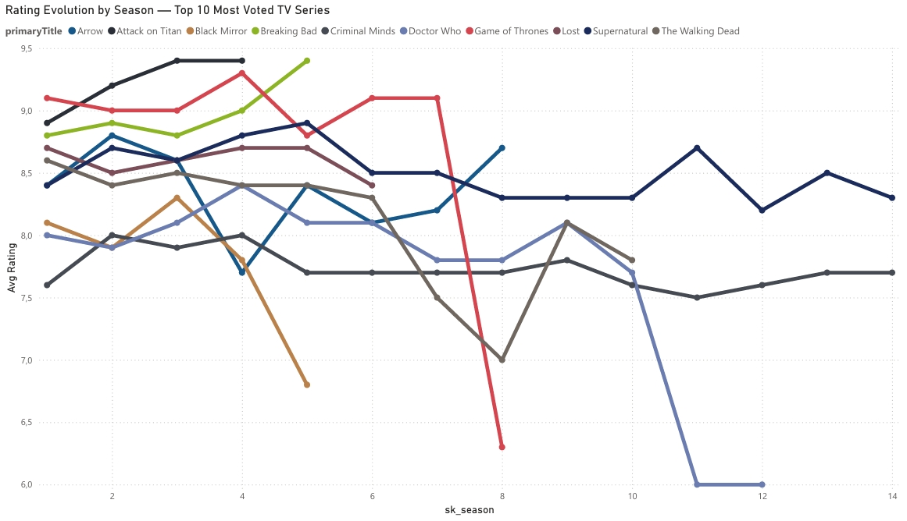
 
### Q2 — Genre Quality Heatmap
 
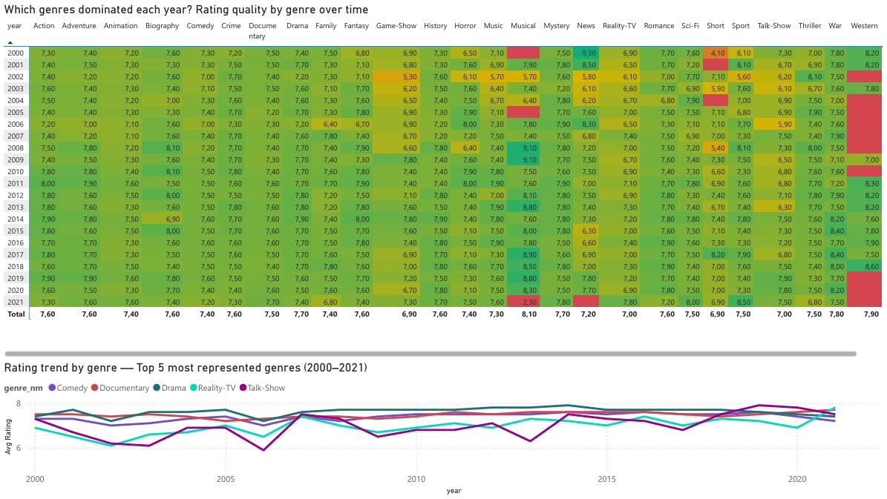
 
**Visual 1 — Heatmap:** Matrix visual with conditional formatting (red = low, green = high). Rows: year (2000–2021), Columns: genre_nm, Values: `Avg Rating`. Reveals Musical as a high-rating but low-volume genre, and Reality-TV as consistently the lowest-rated genre.
 
**Visual 2 — Rating Trend by Genre:** Line chart showing the top 5 most represented genres (Comedy, Documentary, Drama, Reality-TV, Talk-Show) from 2000 to 2021. Lines are nearly parallel and stable between 6.5–8.0, indicating that genre quality perception did not change significantly over the period.
 
### Q3 — Consistency by Series Length
 
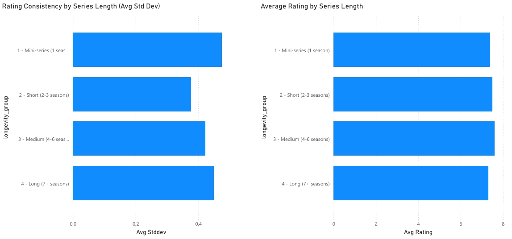
 
**Visual 1 — Avg Stddev by Longevity Group:** Bar chart showing quality variance per group. Mini-series have unexpectedly high variance; Short and Medium series are the most consistent.
 
**Visual 2 — Avg Rating by Longevity Group:** Bar chart showing Medium (4–6 seasons) as the highest-rated group and Long (7+) as the lowest.
 
### Q4 — Audience Engagement Evolution
 
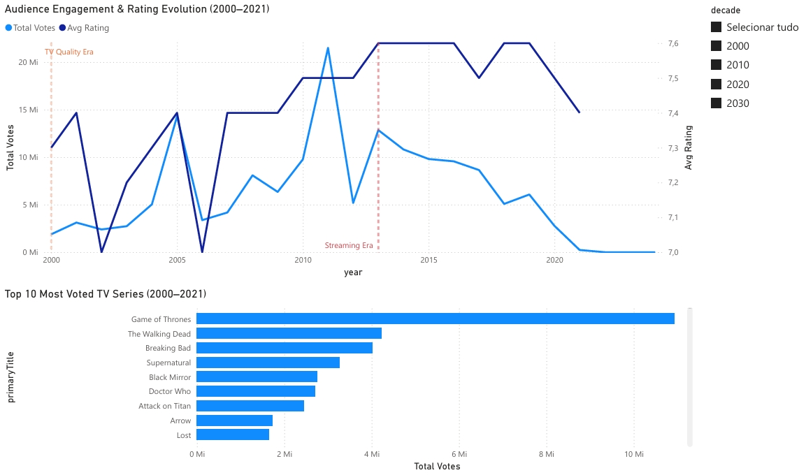
 
**Visual 1 — Dual-axis line chart:** Total Votes (primary Y-axis) and Avg Rating (secondary Y-axis) by year. Two vertical reference lines mark the Quality Era (2000) and the Streaming Era (2013). The vote peak around 2011–2012 followed by a post-2013 decline is clearly visible.
 
**Visual 2 — Top 10 Most Voted Series:** Bar chart showing Game of Thrones dominating with >10M votes — nearly double the second-place series (The Walking Dead).

---

Q5 to Q11 are answered using the ratings star schema implemented in Power BI:


The `fact_ratings` table is designed at a Participant-per-Episode grain. This means that episode-level metrics (ratings and votes) are duplicated for every person involved in a production. To ensure analytical accuracy, the following DAX measures were implemented:

1. Rating (Average)
   - Formula: Rating = `AVERAGE('public fact_ratings'[average_rating])`
   - Description: This measure calculates the simple arithmetic mean of the ratings provided for the filtered context.
   - Behavior: Since the average_rating is a non-additive quality metric, using AVERAGE is generally safe when analyzing specific episodes. However, when aggregating at the Series or Genre level, it provides a mean of means, which is useful for identifying overall quality trends across the casting.

2. Series Corrected Votes (Weighted Total)
   - Formula: `Series Corrected Votes = SUMX(VALUES('public fact_ratings'[sk_episode]), CALCULATE(MAX('public fact_ratings'[num_votes])))`
   - Description: This is the primary measure for reporting total votes.
   - Logic: It first identifies a list of unique episodes (VALUES) within the current filter. For each unique episode, it retrieves the vote count once (MAX) and then sums those individual values.
   - Purpose: It effectively eliminates the "data inflation" caused by the many-to-many relationship, ensuring that an episode with 1,000 votes is only counted as 1,000, regardless of how many actors or directors are linked to it. 

3. Unique Episode Count
   - Formula = `Unique Episode Count = DISTINCTCOUNT('public fact_ratings'[sk_episode])`
   - Description = This measure counts the number of unique episode identifiers present in the current filter context.
   - Behavior = Due to the Participant-per-Episode granularity of the fact_ratings table, a standard COUNT would overstate the number of episodes by multiplying them by the number of crew members. `DISTINCTCOUNT` effectively collapses these duplicates, ensuring each episode is counted only once, regardless of how many actors or directors are linked to it.
   - This is the foundational metric for analyzing series length, seasonal volume, and calculating the "Jump the Shark" effect. It should always be used as the denominator when calculating per-episode averages to ensure statistical integrity.

### Q5 — Which genres consistently receive the highest average ratings?

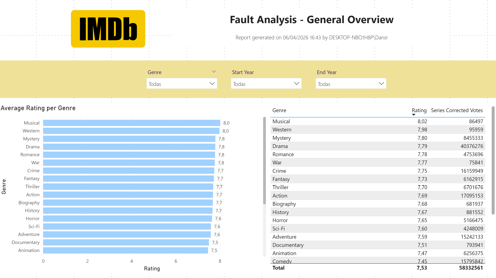

Our cross-genre analysis reveals an inverse relationship between production volume and average rating. Niche genres like Musical and Western boast the highest quality scores (~8.0), likely due to high production value and dedicated fanbases. In contrast, mass-market genres like Comedy show lower average ratings.

### Q6 — Which genres are consistently the most popular based on the number of votes?

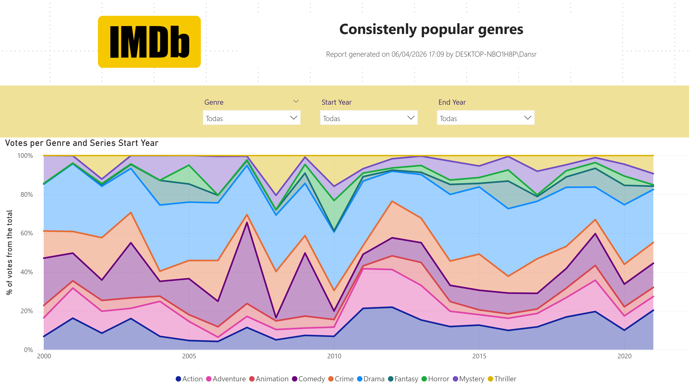

While the TV landscape features over 28 genres, popularity is consistently dominated by a core group. As seen in the visualization, Drama, Action and Comedy maintain a combined vote share of over 40% consistently since the year 2000."

### Q7 — Who are the top 10 actors whose movies have the highest average rating with at least 100,000 total votes?

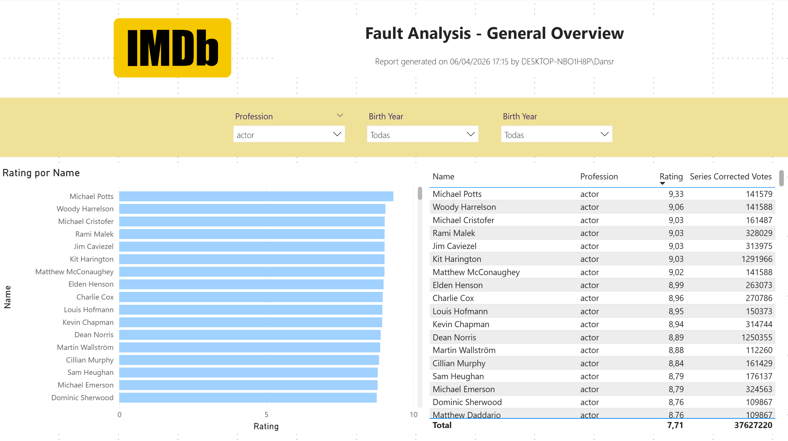

Our analysis reveals that **Michael Potts** is the highest-rated actor among those with significant audience reach. By filtering for a minimum of 100,000 votes, we have isolated the top tier of television talent, where actors like Kit Harington and Dean Norris demonstrate an exceptional balance between critical acclaim (9.0+ ratings) and massive public engagement (1M+ votes)."

### Q8 — Who are the top 10 directors whose movies have the highest average rating with at least 100,000 total votes?

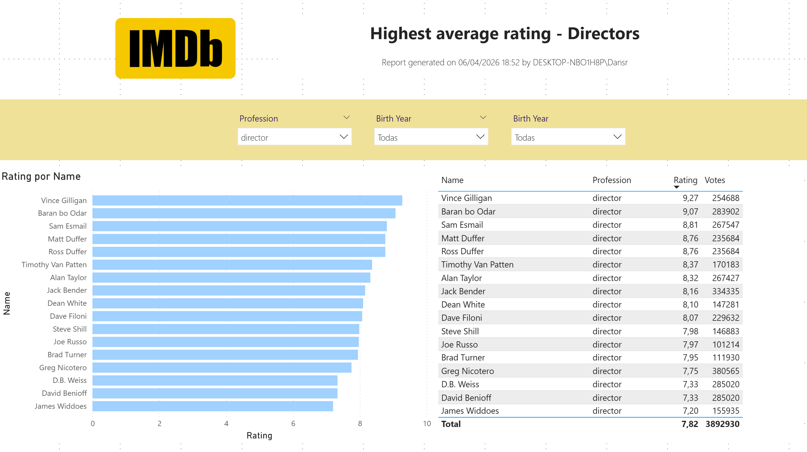

The director's analysis identifies **Vince Gilligan** as the most consistent high-performer in the dataset, boasting a 9.27 rating. By using our Series Corrected Votes measure, we can accurately compare veteran directors like Jack Bender (8.16 with 334k votes) against contemporary masters, providing a clear picture of directional excellence over the last 26 years.

### Q9 — What is the correlation between the total number of episodes in a series and its overall average rating?

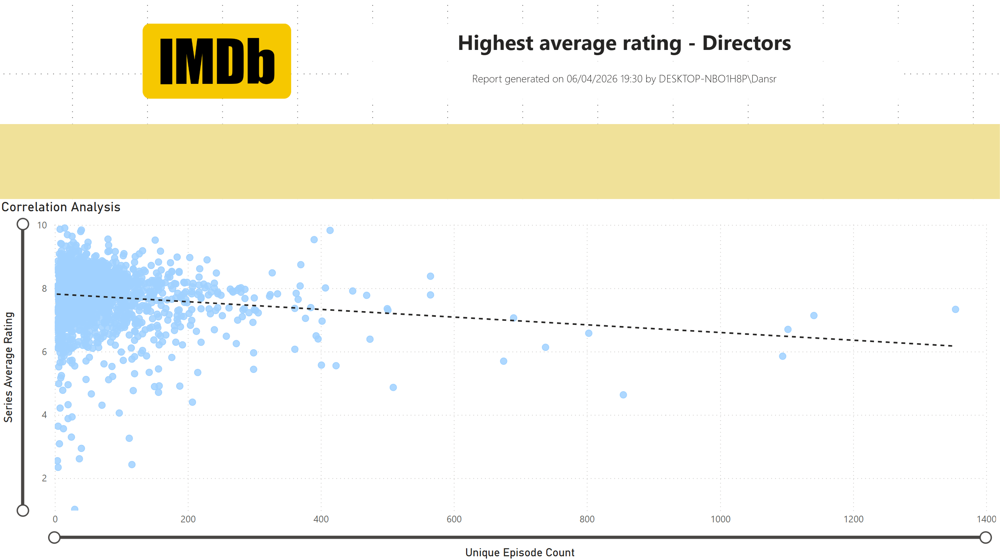

Our correlation analysis confirms a negative trend between series length and quality. While short series (0-200 episodes) exhibit high volatility in ratings, longer series tend to converge towards lower average scores. This suggests that sustained production over hundreds of episodes is often associated with a decline in perceived quality, with only a few outliers managing to maintain 'prestige' ratings in the long run.

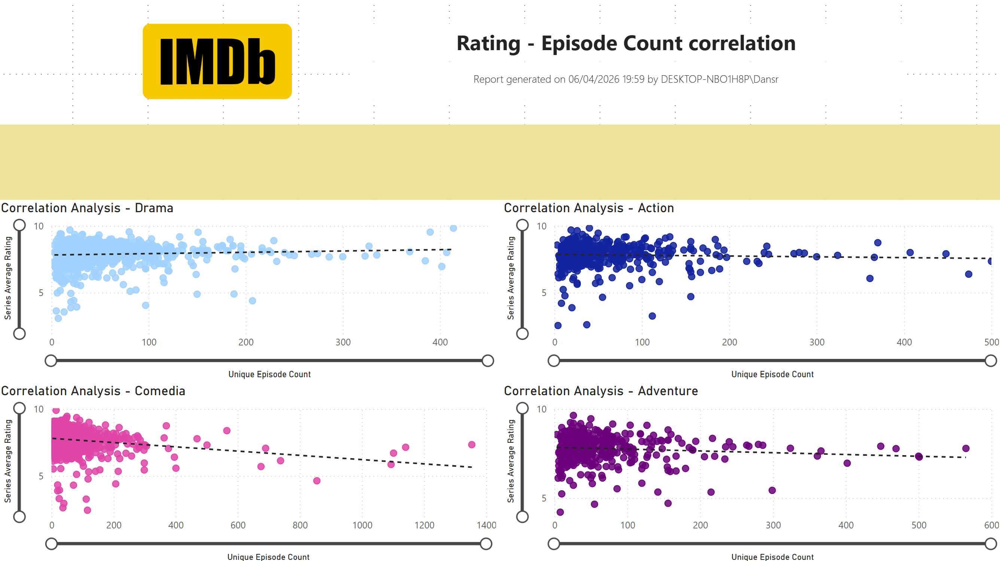

Our Small Multiples analysis confirms that the correlation between quantity and quality is genre-dependent. While Drama and Action exhibit remarkable stability regardless of episode count, Comedy shows a clear 'Fatigue Effect,' with average ratings declining significantly as the series length exceeds 400 episodes.

### Q10 — At what point (episode number) do highly-rated series typically start to see a significant decline in user ratings? (Jum the Shark effect)

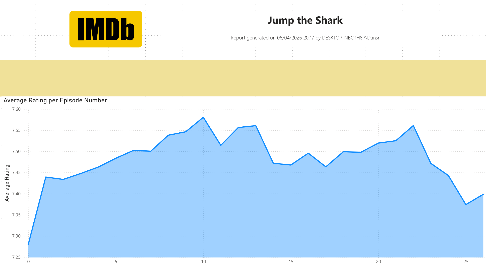

Analysis of high-engagement episodes (>50k votes) reveals a clear pattern: quality typically peaks at episode 10 and maintains a high plateau until episode 22. Beyond this point, we observe a significant 'Jump the Shark' effect, where the average rating drops by nearly 0.2 points in a short span. This suggests that for major TV productions, the transition into the late 20s in episode count represents a critical risk zone for audience retention and quality perception.

--- 

Q12 to Q15

### Q11 — Who are the most active participants in the IMDB dataset by number of participations?
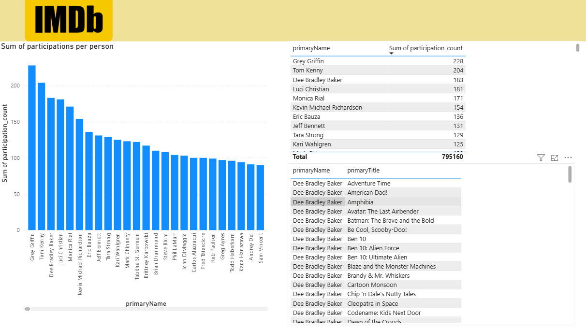

In any IMDb TV Series dataset, the most "active" participants are almost exclusively Voice Actors. Names like Grey Griffin, Frank Welker (Scooby-Doo), Tom Kenny (SpongeBob SquarePants), Tara Strong (The Fairly OddParents), and Dee Bradley Baker (Star Wars: The Clone Wars) dominate this list.

In TV Series, a live-action actor shoots one episode and gets one credit. A voice actor might provide voices for 3-4 different background characters in a single episode, and animated shows often run for hundreds of episodes.


### Q12 — Which participants are highlighted by specialization or generalization in terms of genres worked in their careers?  
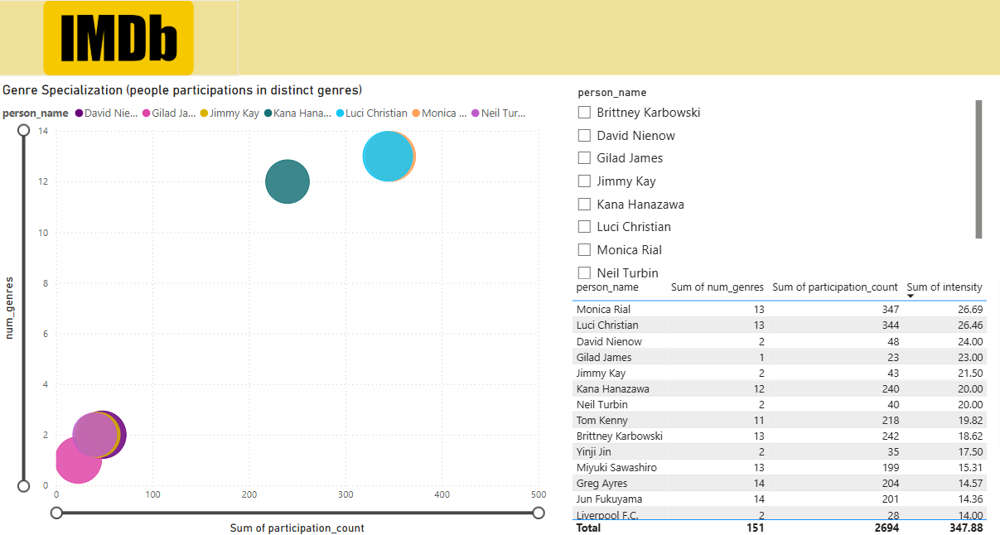

Generalists (Top Right): The prolific voice actors mentioned above. Because animation spans Comedy, Family, Action, and Sci-Fi, they naturally accumulate a massive variety of genres.

Specialists (Top Left / Bottom Right): People with high title counts but low genre counts. For example, Jimmy Kay is a producer listed as specialist since though he have many titles produced, his focus is the music Tv Series. One intersting entity is the Liverpool F.C as specialist, what makes sense since they have a TV Series for the 2024 season of premier league, all concentrated in genre Sports.

### Q13 — Which pairs of participants have the strongest collaborative relationships appearing together in the most titles and which genres their worked on?
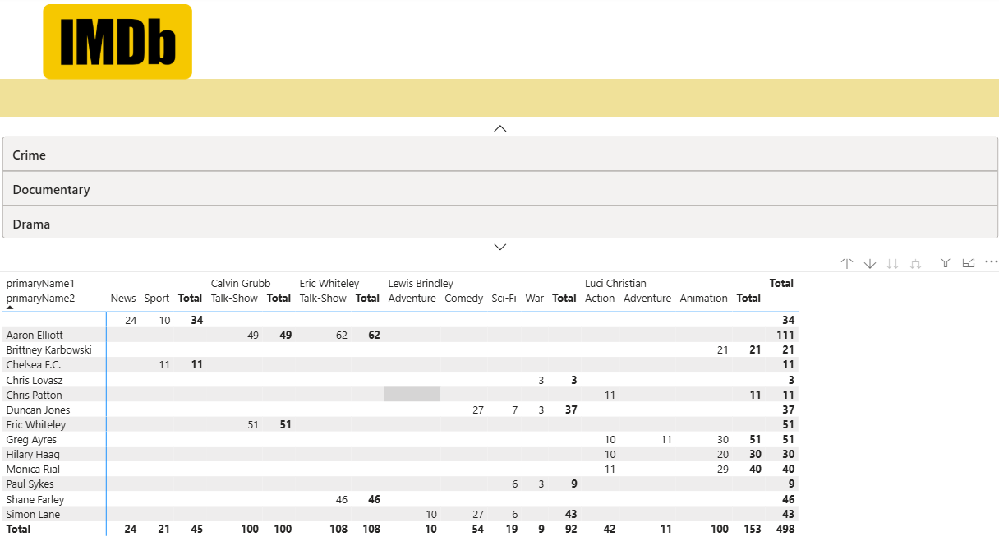    

This visualization reveals industry clusters. In the TV ecosystem, the strongest collaborative pairs are usually co-stars of long-running shows. For Talk-Shows we have highlights for Calvin Grubb , Aaron Elliot and Eric Whiteley. They produced Blind Wave Mailbag! which counts with 257 episodes, making them jump into the listing. There at least one more zones of highlighs. The voice actors in animations, action and adventure (Monica Rial, Hilary Haag).

### Q14 — Who have more titles per genre (specialist in certain genres) and how many titles have they worked on?  
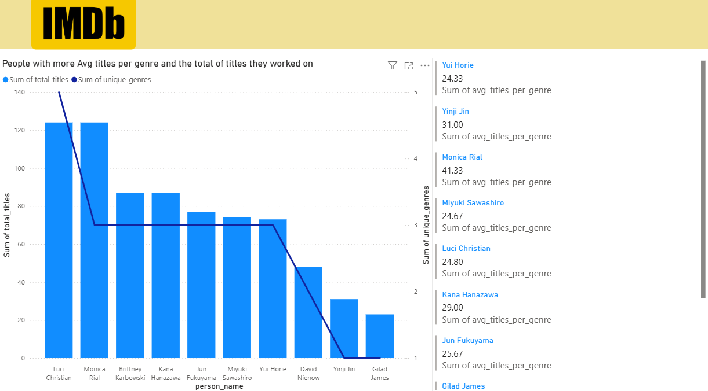


This visualization reinforces the mentioned important participation of voice actors and the power of animations world in TV series. They are not concentrated in Animation genre and many have genres defined as Action, Drama, Comedy, etc. making them highly representative in the participants analysis 

### Q15 — Episode Count Impact
 
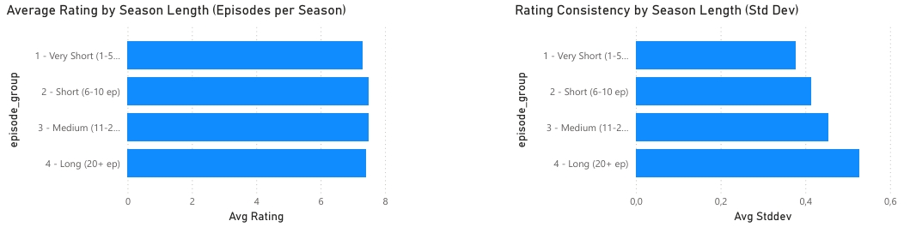
 
**Visual 1 — Avg Rating by Season Length:** Bar chart showing Short (6–10 ep) as the highest-rated group.
 
**Visual 2 — Avg Stddev by Season Length:** Bar chart showing Long (20+ ep) as the most inconsistent group, with stddev ~0.55 versus ~0.38 for Very Short seasons.

---

## 7. Conclusion and Critical Reflection
 
The implementation of this Data Warehouse demonstrates the clear advantage of OLAP systems for analytical workloads. By de-normalizing the IMDb data into a star schema architecture, we reduced query times for complex aggregations from minutes to seconds compared to an equivalent operational relational model — a direct consequence of the pre-aggregated seasonal grain in `fact_series_performance` and the conformed dimensions shared across all three stars.
 
### Key Findings
 
The five TV series market questions yielded consistent and analytically meaningful results. Quality fatigue is statistically confirmed: series lose an average of 0.6 rating points over 20 seasons, with Game of Thrones representing the most extreme case — a collapse of over 2.5 points between season 7 and season 8. Genre quality is stable but stratified: Musical and Western achieve the highest ratings but with low production volume, while Reality-TV is consistently the lowest-rated genre regardless of year. Medium-length series (4–6 seasons) represent the optimal format, balancing narrative depth with creative consistency. Audience engagement peaked around 2011–2012 and declined post-2013, reflecting fragmentation across streaming platforms rather than a decline in consumption. Finally, compact season formats (6–10 episodes) consistently outperform long seasons in both average rating and consistency — a pattern that validates the HBO and Netflix production model adopted industry-wide during the streaming era.
 
The participant network analysis revealed equally compelling patterns. Voice actors dominate participation counts due to the multi-character nature of animation, which inflates both role counts and genre diversity. The strongest collaborative pairs are anchored in long-running productions, and genre specialisation is far more prevalent among live-action professionals than among animation crews.
 
### Conclusion
 
The project successfully demonstrates how a dimensional model built on a Big Data source transforms millions of raw records into actionable market intelligence — answering questions about the global TV industry that would be analytically intractable in the original operational database.
